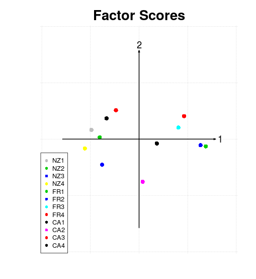
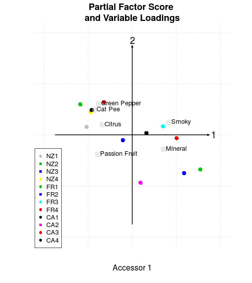
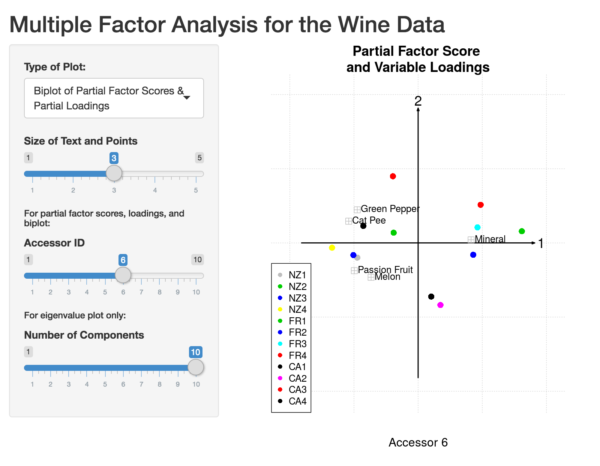
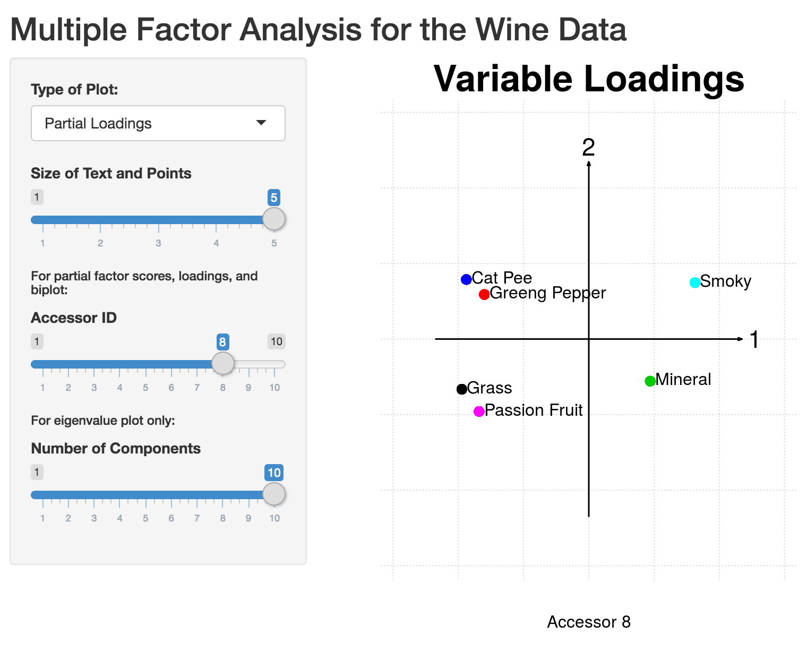

```{r setup, include=FALSE}
knitr::opts_chunk$set(echo = FALSE)
```

## Multiple Factor Analysis in R Using "MFA" Package

This presentation will give a brief overview of how and when to use Multiple Factor Analysis. We will also demonstrate how to do Multiple Factor Analysis using the "MFA" package in R, using a fictitious example.

## What is Multiple Factor Analysis, and when should you use it?

- Multiple Factor Analysis (MFA) is used to analyze different sets of data taken on the same observations.
- Bullet 2
- Bullet 3

## Output of MFA

- Common and partial factor scores
- Loadings

## Overview of the Steps of MFA

- There are multiple ways to perform MFA on a given data set (i.e. using generalized singular value decomposition, simple singular value decomposition on a transformed data set, cross-product matrices, or the factor scores from a single data table).
- The "MFA" package in R uses a simple singular value decomposition on a transformed data set, so that is the method we will walk through in this presentation. For others, see [paper].

## Overview of the Steps of MFA

- Start with a data set X containing J variables measured on a common I observations, separated into K data tables
  X = [X_1 | ... | X_K}
  where each matrix X_i has I rows.
  
## Normalize the Data

- Center each column by its mean
- Scale each column such that the sum of the squares of its entries is equal to 1

```{r}
scaling_vec <- apply(subset(wines, select = unlist(sets)), 2, function(x) sqrt(sum((x - mean(x))^2)))
```

- scaling_vec contains a value for each active variable by which the data will be scaled

## Calculate the weight of each data table

- Run a simple PCA on each data table
- Gamma_i is the first singular value for table i
- The weight, alpha_i, is

      alpha_i = 1 / (gamma_i)^2

## Create the weightings matrix A

- Calculate the weight for each table and store in a matrix, A

      A = diag{alpha_1 * 1[1], alpha_2 * 1[2], ..., alpha_K * 1[K]}
  
  where 1[k] is a vector of ones the length of the number of variables in X_k

## Transform the original data set using the weightings matrix A

- Scale each data table by the square root of its weight and concatenate into a new, transformed data set X_tilde

    X_tilde = [sqrt(alpha_1)*X_1 | sqrt(alpha_2)*X_2 | ... | sqrt(alpha_k)*X_K]


## Simple PCA on Transformed Data

- Singular value decomposition of transformed data gives

X_tilde = U_tilde * Delta_tilde * V_tilde_T

- From this, we can calculate the factor scores as well as the loadings.

## Calculating the Matrix of Factor Scores, F

F = U_tilde * Delta_tilde

## Calculating the Loadings Matrix, Q

Q = V_tilde * A^(-1/2)

where A is the matrix of the weights.

## Calculating the Partial Factor Scores for a given factor i

F_i = K * alpha_i * x_i * Q_i

where K is the total number of factors in the analysis, X_i is the original data table, and Q_i is the matrix of partial loadings for that factor

Get the partial loadings from the complete loadings table

Q = [Q_1_T | ... | Q_K_T]^T

## Functions in the "MFA" Package

- mfa(data, sets, ncomps = NULL, center = TRUE, scale = TRUE)
- etc.

## The mfa function

- Creates object of class "mfa" containing the eigenvalues for the original data set, the common and partial factor scores, and the loadings matrix

> mymfa <- mfa(data, sets, ncomps = NULL, center = TRUE, scale = TRUE)

## Inputs to the mfa function

- "data": data frame or a matrix
- "sets": list of vectors of length equal to the number of data tables. Each vector corresponds to a data table and specifies the variables from the original data in that table. The vectors can either be numeric (column indices) or characters (column names)
- "ncomps": an integer or NULL value, specifying the number of components you want in the output of the MFA
- "center": either a logical value or a vector of length equal to the total number of active variables, specifying the value around which each column will be centered. If "center" is TRUE, each column will be centered around its mean. If "center" is FALSE, no centering will be done.
- "scale": either a logical value or a vector of length equal to the total number of active variables, specifying the value by which each column will be scaled. If "scale" is TRUE, each column is scaled by its standard deviation. If "scale" is FALSE, no scaling will be done.

## Example of how to use the "MFA" Package on a fictitious data set

- The data contains the evaluation of 12 different wines by 10 expert assessors. Each assessor measured the wine on 4 criteria--cat-pee, passionfruit, green pepper and mineral--as well as any other criteria they desired. The raw data looks like this:

```{r}
wines <- read.csv("https://raw.githubusercontent.com/ucb-stat243/stat243-fall-2016/master/problem-sets/final-project/data/wines.csv", stringsAsFactors = FALSE)
wines
```

## Performing MFA on the data set "wines"

- Printing the object "mymfa" gives a summary of the output from the analysis

```{r}
sets <- list(2:7, 8:13, 14:19, 20:24, 25:30, 31:35, 36:39, 40:45, 46:50, 51:54)

mymfa <- mfa(wines, sets, ncomps = 2, center = TRUE, scale = scaling_vec)
mymfa
```

## Extracting specific outputs from the object "mymfa"

- "mymfa" contains the following elements:
  - eigenvalues
  - common factor scores
  - partial factor scores
  - loadings
- To call a specific element:

```{r}
mymfa$common_factor_scores
```

## Example using the "MFA" Package

Plotting method
========================================================
We can use the plot method of an mfa object to visualize the compromise of tables, partial factor scores, and variable loadings for any given two dimensions
- There are five different types of plots this method could create
  - Type 1: plot for factor scores
  - Type 2: a bipot of partial factor scores and partial loadings for any specific accessor
  - Type 3: all 10 biplots
  - Type 4: a plot of partial factor scores for any specific accessor
  - Type 5: a plot of variale loadings for each accessor

## Example using the "MFA" Package

Plotting method examples
========================================================
- to call a specific type of plot, see below examples:
```{r echo = FALSE}
plot(mymfa, type = 1)
plot(mymfa, type = 2, X = 1, loading_labels = c("Cat Pee", "Passion Fruit", "Green Pepper", "Mineral", "Smoky", "Citrus"))
plot(mymfa, type = 3, loading_labels = NULL)
plot(mymfa, type = 4, X = 1) 
plot(mymfa, type = 5, X = 1)
```

Sample plots: (more to come in Shiny app)
 


## Example using the "MFA" Package

- summary of eigenvalues

## Example using the "MFA" Package

- Rv coefficients

## Example using the "MFA" Package

Lg Coefficient
========================================================

The LG coefficient between two tables is defined as:

$$ L_{g(k,k')} = trace[(X_kX_k^T) x(X_{k'}X_{k'}^T)] x (\alpha_k x \alpha_{k'}) $$

where $\alpha_k$ is the inverse of the largest singular value squared of $X_k$.

The function `Lg` computes the Lg coefficient between two tables. It takes as inputs two tables or matrices, and outputs a scalar.


```{r, echo = FALSE}
library(MFA)
wines <- read.csv("https://raw.githubusercontent.com/ucb-stat243/stat243-fall-2016/master/problem-sets/final-project/data/wines.csv", stringsAsFactors = FALSE)

#According to the dataset, creating a list of vectors indicating the sets of variables
sets <- list(2:7, 8:13, 14:19, 20:24, 25:30, 31:35, 36:39, 40:45, 46:50, 51:54)

#The scaling vector
scaling_vec <- apply(subset(wines, select = unlist(sets)), 2, function(x) sqrt(sum((x - mean(x))^2)))

#create the mfa object
mymfa <- mfa(wines, sets, ncomps = 2, T, scaling_vec)
tables <- data_tables(wines, sets, TRUE, scaling_vec)
```

```{r}
library(MFA)
Lgtable1_table2 <- Lg(tables[[1]], tables[[2]])
Lgtable1_table2
```

The function `Lg_table` computes the matrix of Lg coefficients for various tables. It takes as inputs a dataset, and a list of indices indicating which tables from the dataset to compute the Lg coefficients for.
```{r}
sets_shift2 <- list(1:6,7:12,13:18,24:29,39:44)
dataset2 <- as.data.frame(tables)
Lg_dataset <- Lg_table(dataset2, sets_shift2)
Lg_dataset
```


Shiny app for the wine data: how to use it
========================================================
We have published a shiny app to exemplify various graphical features of the MFA package for the wines dataset. To use it, simply go to the url:
https://xzhang.shinyapps.io/Shiny_MFA/

On the app, one can select from one of six different plots. They include:
1) a plot of common factor scores,
2) a bipot of partial factor scores and partial loadings for each accessor,
3) all 10 biplots,
4) a plot of partial factor scores for each accessor,
5) a plot of variale loadings for each accessor, and
6) a barplot of eigenvalues.

For plots 2), 4), and 5), there is a slider input to select the accessor ID.

For plot 6), there is a slider input to indicate the number of components to keep.

There is also a slider input to alter the size of the text and points.


Shiny app for the wine data: example
========================================================




etc.
